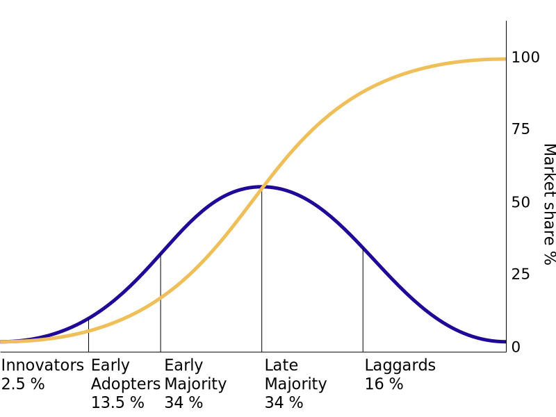
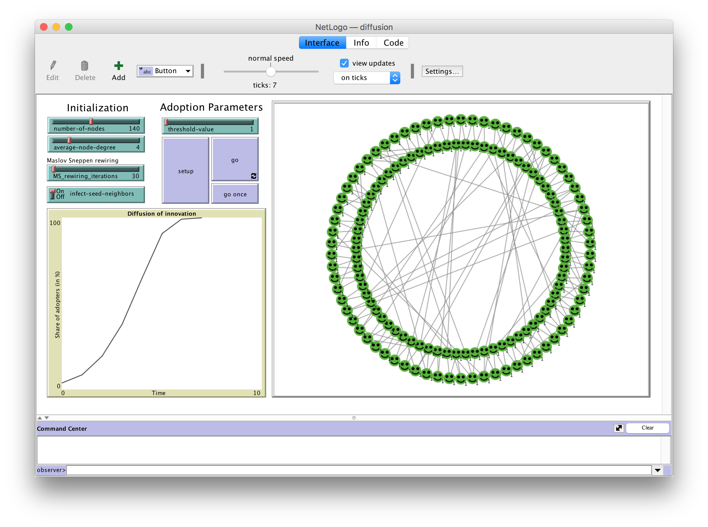

## Aim

This short workshop is intended to introduce agent-based modeling and kickstart working with NetLogo. In the first part we will discuss why one would use ABM's as a theoretical tool to understand democratic debate. In the second part, we will get you started with NetLogo, a very intuitive and easy tool to program simple ABMs. We explain the basics of NetLogo and show some simple and some more advanced code.

**Aims:**

* Get a feeling for when and why to apply Agent-Based Modeling
* Learn the basic principles of NetLogo
* See some basic and some advanced NetLogo code

---

## Preparation

* If you want to play around with the code yourself, download and install `NetLogo' (version 6 or higher) on your machine beforehand. A safe download of the software can be found <a href="https://ccl.northwestern.edu/netlogo/download.shtml" target="_blank">here</a>.

---

## Resources

* <a href="https://docs.google.com/presentation/d/1RLmK_4dZnpl0KLX8A6pDFh0NzUxqWSK3Z1HONaq0csA/edit?usp=sharing" target="_blank">Presentation slides</a>
* <a href="diffusion.nlogo" download>A NetLogo model for diffusion of innovation</a>
* <a href="diffusion-experiment-analysis.R" download>R code for the analysis of the BehaviorSpace experiment</a>
* <a href="https://ccl.northwestern.edu/netlogo/docs/" target="_blank">The NetLogo User Manual</a>

---

## Suggested readings

On actor-based thinking:

* Macy, M. W., & Willer, R. (2002). From factors to actors: Computational sociology and agent-based modeling. Annual review of sociology, 28(1), 143-166. doi: [10.1146/annurev.soc.28.110601.141117](https://doi.org/10.1146/annurev.soc.28.110601.141117)

On the relation between ABM and CSS:

* Flache, A., Mäs, M., & Keijzer, M. A. (2022). Computational approaches in rigorous sociology: agent-based computational modeling and computational social science. Handbook of Sociological Science, 57-72. [10.4337/9781789909432.00011](https://doi.org/10.4337/9781789909432.00011)
* Keuschnigg, M., Lovsjö, N., & Hedström, P. (2018). Analytical sociology and computational social science. Journal of Computational Social Science, 1, 3-14. [10.1007/s42001-017-0006-5](https://doi.org/10.1007/s42001-017-0006-5)

A more practical guide to starting with ABM:

* Flache, A., & de Matos Fernandes, C. A. (2021). Agent-based computational models. Research Handbook on Analytical Sociology, 453-73. [10.4337/9781789906851.00033](https://doi.org/10.4337/9781789906851.00033)

---

## Exercise 

If you want, you can do this little exercise to get your hands dirty with NetLogo coding.

For the hands-on part of the session, we looked at a simple alternative to <a href="https://en.wikipedia.org/wiki/Diffusion_of_innovations" target="_blank">Everett Rogers' theory about the diffusion of innovation</a> from a complexity perspective. Rogers argued that the often observed *S-curve* in the adoption of innovations is due to differences in individual tendencies to adopt an innovation. Assuming that (1) such a tendency is normally distributed in a population, and (2) people are aware of the number of others that have adopted the innovation, reveals the non-linear relationship between time and share of the population that adopted some innovation.

<center>
{width=50%}

*Fig 1. The S-curve (yellow) explained by a distribution of adopters (blue)*
</center><br>

Alternatively, Agent-Based Modeling can offer a competing explanation that relies on network structure, but does not make assumptions about individual differences, nor assumes that people have complete information about the state of the world. 

### The model

We programmed a simple diffusion model in NetLogo. Turtles are placed on a ring network and adopt the color trait of their neighbors depending on some threshold. The code includes a rewiring procedure that enabables the construction of long range ties. 

<center>
<a href="diffusion.nlogo" download>
{width=70%}

\>\> Download the simple diffusion model here \<\<</a>
</center>

### What to do?

1. **Inspect the code**; do you understand the main procedures?
2. Come up with **your own extension** to the model. Perhaps you are interested in how the network structure affects macro outcomes? Maybe you think the influence function could be enriched? Or what about a hybrid of Rogers' adoption thresholds and the 'plain' network model?
3. If time permits, **run an experiment** in `BehaviorSpace` and report the results to the group.

<br>

---

## Analysis of the basic model

```{r, echo=F}
library('ggplot2')
setwd('/Users/marijnkeijzer/SURFdrive/nnc/ABM101')

   # read in raw data frame, note that we skip the first 6 lines containing contextual information
raw.df <- read.csv('diffusion experiment-table.csv',header=T,skip=6)

   # transform the absolute number of turtles that adopted the trait to a proportion
raw.df$count.turtles.with..color...green. <- raw.df$count.turtles.with..color...green. / raw.df$number.of.nodes
```

We ran an experiment in *BehaviorSpace* where we varied the proportion of rewiring between 0 and 0.1 with increments of 0.01. We asked NetLogo to count the number of agents that adopted the innovation at every tick and write the result to a csv file. The parameter settings of the experiment read:

```
["rewiring-proportion" [0 0.01 0.1]]
["infect-seed-neighbors" true]
["number-of-nodes" 500]
["average-node-degree" 4]
["threshold-value" 1]
```

This dataset is now ready to be analyzed in R (or any statistical software of course). The first thing to notice is that rewiring drastically changes the time until convergence. The distribution across conditions is very skewed, and therefore we cannot simply plot the number of agents that adopted the innovation, by rewiring proportion. We need to transform the data to an aggregated format where the mean proportion of agents that adopted the trait in a certain period, or percentile of the run is calculated. This function looks like:

```{r}
DiffusionPercentiles <- function(Data=raw.df,Definition=10){
  df <- data.frame(id=c(99),rewiring=c(99),ticks=c(99),percentile=c(99),adopted=c(99))
  iterator <- 1
  
  for(i in unique(Data$X.run.number.)){
    increment <- max(Data$X.step.[Data$X.run.number==i]) * 1 / Definition
    
    for(j in 1:Definition){
      df[iterator,] <- c(
        i,
        Data$rewiring.proportion[Data$X.run.number.==i][1],
        max(Data$X.step.[Data$X.run.number.==i]),
        j,
        mean(Data$count.turtles.with..color...green.[(Data$X.step. > 0 - increment + increment * j) & Data$X.step. < increment * j & Data$X.run.number. == i]))
      iterator <- iterator + 1
    }
  }
  return(df)
}

  # and actually run the function:
df <- DiffusionPercentiles(Definition=10)
```

With this dataset, we can plot the mean convergence time, by rewiring proportion:

```{r,fig.width=3,fig.height=2.5,fig.align='center',warning=F}
ggplot(data=df,aes(x=rewiring,y=ticks)) +
  stat_summary(geom="bar", fun.y=mean, col='black',fill='lightgrey') +
  stat_summary(geom="errorbar", fun.data=mean_cl_normal,width=.002,col='red') +
  theme_linedraw()
```

Indeed, the distribution is rather skewed. When the network is free of any rewiring, the innovation diffuses neatly around the circle network. As more rewiring is introduced, the innovation can travel speedily across some longer ties to infect the larger network quicker. If we now plot the proportion of adopers by model period, we see that this explanation is indeed correct, and we nicely reproduce Rogers' S-curve:

```{r,fig.width=6,fig.height=4,fig.align='center',warning=F}
ggplot(data=df,aes(x=percentile,y=adopted)) +
  stat_summary(geom="line", fun.y=mean,col='red') +
  stat_summary(geom="errorbar", fun.data=mean_cl_normal,width=.5,col='red') +
  stat_summary(geom="point", fun.y=mean,size=1) +
  facet_wrap(rewiring ~ .,nrow=3) +
  ylim(0,1) +
  theme_linedraw()
```

```{js,echo=F}
$(function() {
	// Get page title
  	var pageTitle = $("title").text("ABM 101");
	});
```